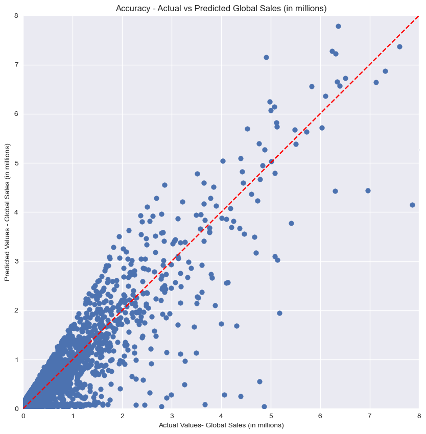
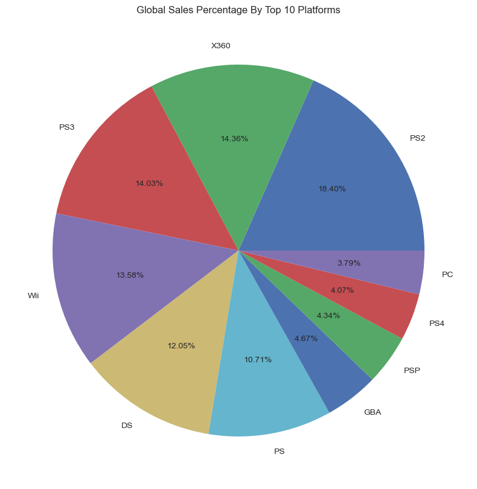
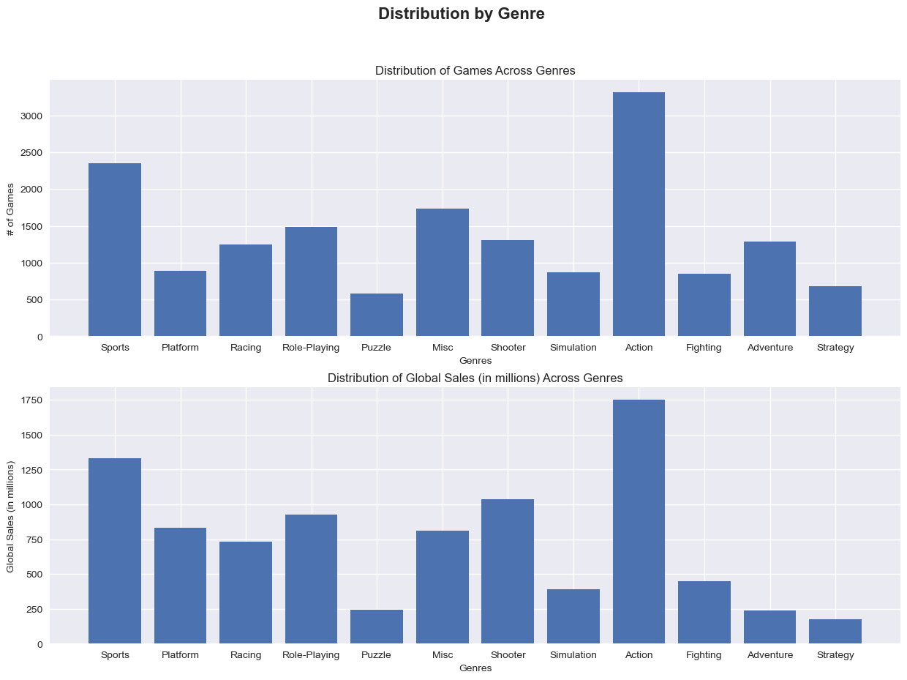

<h1>Predict a Video Game’s Global Sales Using Machine Learning</h1>

YouTube Demonstration (WIP)

<h2>Description</h2>

<h3>Problem Summary</h3>
KaitoIma Gaming, a large video game company based in North America, has recently released a new game called "KAITO,” which has achieved exceptional success in the gaming industry. Because of this achievement, the organization is considering expanding its market presence to gamers all over the world. Although the company normally focuses on the NA market, the potential for growth through expansion of customers has piqued the interest of KaitoIma Gaming. To make an informed decision, the company proposes leveraging data from previous game releases to create an application to evaluate the feasibility and potential return on investment of this expansion. This tool will utilize machine learning and will meet the company’s needs by predicting the global sales of a game based on its features.

<h3>Application Benefits</h3>
This machine learning-driven solution will enhance decision making across the company, giving a rough estimate of which markets to target and which characteristics of a game will resonate with gamers on a worldwide scale. A semi-accurate prediction of a game’s global sales will help the company in curating what the best genre, platform, and publisher to use in order to maximize the customer outreach and profits. Additionally, this information will grant a competitive edge to the company as it aids in solidifying their position in the industry.

<h3>Application Description</h3>
This application will be standalone and written in the programming language Python because of its ease of compatibility with libraries that will be used for machine learning calculations and graphs. The development environment will be through a web-based environment called Jupyter Notebook, and that will be used for a distribution for scientific computing called Anaconda. Using existing historical data from existing games, the data will be used to train a Linear Regression machine learning model in order for the application to predict the number of global sales. Additionally, charts and graphs will be used to visualize the relationships between data variables.

<br />


<h2>Languages and Utilities Used</h2>

- <b>Python</b> 
- <b>Pandas, NumPy, Matplotlib, Scikit-learn</b>
- <b>Anaconda</b>

<h2>Environments Used </h2>

- <b>Jupyter Notebook</b>

<h2>Program walk-through:</h2>

<p align="center"></p>

<h3>Accuracy</h3>
<hr>
<p>A scatter plot was employed to visualize the accuracy of the predictive model. By plotting the predicted global sales and actual global sales, the model’s performance could be easily assessed and used to refine the model. The accuracy of the data can be measured by how close the dots are to the dotted red line. The model tends to stay consistently near the line, proving to be a reliable source of information.</p>


<h3>Platform Distribution</h3>
<hr>
<p>We could understand the popularity of each platform and analyze its significance in the context of global sales by examining the pie graph. We were able to discover platforms with large user bases and potential strong market demand thanks to this knowledge. </p>


<h3>Genre Distribution</h3>
<hr>
<p> A bar graph was also used to visualize the distribution of genres across the data set, and the distribution of global sales across different genres. The genres with the highest and lowest sales figures could potentially be identified by measuring the heights of the bars. Our decision-making process for selecting the most potential genres for global market expansion was driven by this analysis. It has shown that while some genres have a majority advantage over other games, they fall short in terms of global sales. One specific example is that while the adventure genre trumps the platform genre in terms of number of games, the platform genre performs significantly better when it comes to international sales.</p>



<!--
 ```diff
- text in red
+ text in green
! text in orange
# text in gray
@@ text in purple (and bold)@@
```
--!>
